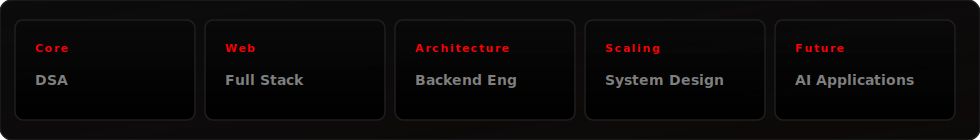

<table width="100%" style="border-collapse: collapse; border: none; margin-bottom: 30px;">
  <tr style="border: none;">
    <!-- Left Column: Branding -->
    <td width="55%" valign="middle" style="border: none; padding-right: 30px; font-family: -apple-system, BlinkMacSystemFont, 'Segoe UI', Helvetica, Arial, sans-serif;">
      <h1 style="font-size: 48px; font-weight: 800; margin: 0; color: #FFFFFF; letter-spacing: -1.5px; line-height: 1.1;">Nidhi Singh</h1>
      

        Computer Science Student &bull; Full Stack Developer
      

      

        Building software, dashboards and AI-powered products. Engineering clean, high-performance web applications and designing intuitive product user interfaces.
      

      

        
        
        
      

    </td>
    <!-- Right Column: Premium Animated Cockpit Illustration -->
    <td width="45%" align="center" valign="middle" style="border: none;">
      
    </td>
  </tr>
</table>

---

### About

* 🎓 **Education:** Sir M. Visvesvaraya Institute of Technology (VTU)
* 📈 **Academic Excellence:** 9.22 CGPA
* ⚙️ **Core Principle:** Transitioning abstract ideas into high-performance, production-ready system architectures.

---

### Tech Stack

  

---

### GitHub Dashboard

<table width="100%" style="border-collapse: collapse; border: none; margin-top: 15px;">
  <tr style="border: none;">
    <!-- Stats Card -->
    <td width="50%" align="center" valign="top" style="border: none; padding: 6px;">
      

        
      

    </td>
    <!-- Streak Card -->
    <td width="50%" align="center" valign="top" style="border: none; padding: 6px;">
      

        
      

    </td>
  </tr>
  <tr style="border: none;">
    <!-- Languages Card -->
    <td width="50%" align="center" valign="top" style="border: none; padding: 6px;">
      

        
      

    </td>
    <!-- Activity Graph Card -->
    <td width="50%" align="center" valign="top" style="border: none; padding: 6px;">
      

        
      

    </td>
  </tr>
</table>

---

### Current Focus

  

---

  Code with purpose. Build with strategy.

