  

  

  Building software, dashboards and AI-powered products. Engineering clean, high-performance web applications and designing intuitive product user interfaces.

  
  
  

---

### About

* 🎓 **Education:** Sir M. Visvesvaraya Institute of Technology (VTU)
* 📈 **Academic Excellence:** 9.22 CGPA
* ⚙️ **Core Principle:** Transitioning abstract ideas into high-performance, production-ready system architectures.

---

### Tech Stack

  

---

## GitHub Dashboard

  

  

  

 

  

 

  

  

  

  

  

---

  Code with purpose. Build with strategy.

